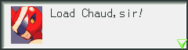

# chaudloader



chaudloader is a mod loader for Mega Man Battle Network Legacy Collection.

## For users

1. Run `install.exe`.

2. Start the game. Mods in the `mods` folder will be activated in alphabetical order.

## For modders

Mods consists of the following files in a directory inside the `mods` folder:

-   `info.toml`: Metadata about your mod. It should look something like this:

    ```toml
    title = "my cool mod"
    version = "0.0.1"
    authors = ["my cool name"]
    unsafe = false  # set to true if you want to use scary unsafe functions
    requires_loader_version = "*"  # or any semver requirement string
    ```

-   `init.lua`: The Lua script to run on mod load.

### Asset modding

In `init.lua`, you may use the following functions:

```lua
--
-- Execution environment
--

-- Game name ("Vol1" or "Vol2").
chaudloader.GAME_ENV.name: string

-- SHA256 of the EXE.
chaudloader.GAME_ENV.exe_sha256: string

-- Name of the current mod.
chaudloader.MOD_ENV.name: string

-- Path to the current mod.
chaudloader.MOD_ENV.path: string

--
-- exe/data .dat file functions
--

-- Opens an exe/data .dat file located in exe/data (e.g. `exe6.dat`).
function chaudloader.ExeDat(dat_filename: string): ExeDat

-- Reads the contents of a file out of the .dat file.
--
-- Previous calls to write_exe_dat_contents are visible to subsequent calls to read_exe_dat_contents.
function chaudloader.ExeDat:read_file(path: string): string

-- Writes the file data into the .dat file.
--
-- Note that this does not mutate the original .dat file on disk, but for all intents and purposes to both the game and the mod loader it does.
function chaudloader.ExeDat:write_file(path: string, contents: string): string

--
-- .map + .mpak file functions
--

-- Unmarshals an .map + .mpak file.
function chaudloader.Mpak(map_contents: string, mpak_contents: string): Mpak

-- Inserts an entry at the given ROM address into the mpak. Existing entries will be clobbered. If contents is nil, the entry will be deleted.
chaudloader.Mpak[rom_addr: integer] = string

-- Reads an entry at the given ROM address.
chaudloader.Mpak[rom_addr: integer]: string

-- Iterates through all entries of an mpak.
pairs(chaudloader.Mpak): (integer, string)

-- Marshals an mpak back into .map + .mpak format.
function chaudloader.Mpak:to_raw(): (string, string)

--
-- Mod file functions
--

-- Reads the contents of a file from the mod folder.
function chaudloader.read_mod_file(path: string): string

-- Lists the contents of a directory from the mod folder.
function chaudloader.list_mod_directory(path: string): string[]

-- Gets the metadata of a file from the mod folder.
function chaudloader.get_mod_file_metadata(path: string): { type = "dir" | "file", size = integer }

--
-- Unsafe functions (mod must have unsafe = true)
--

-- Writes directly into process memory.
function chaudloader.unsafe.write_process_memory(addr: integer, buf: string)

-- Reads directly from process memory.
function chaudloader.unsafe.read_process_memory(addr: integer, n: integer): string

--
-- Utility functions
--

-- Requires a module from the mods directory.
--
-- If unsafe = true, require may load Lua DLLs of the form <name>.dll from the mods directory.
--
--
-- If the name contains dots (`.`), they will be translated to slashes for paths (`/`). If the name is for a Lua DLL, they will be replaced with underscores (`_`) in the loader function. For example, for a library named `foo.bar`:
--
--  - Path: foo/bar.lua (or foo/bar.dll)
--  - DLL entry point: luaopen_foo_bar
--
-- For more information on writing Lua libraries, see https://www.lua.org/pil/26.2.html. If you don't particularly feel like using any Lua features, you may define your luaopen function like so:
--
--    int luaopen_mylibrary(void* unused) {
--        // Do all your logic here.
--        return 0;
--    }
function require(name: string): any

-- Prints a log line.
function print(...)
```

For instance, for a simple font mod, you can write the following script:

```lua
local exe6_dat = chaudloader.ExeDat("exe6.dat")
local exe6f_dat = chaudloader.ExeDat("exe6f.dat")

local font = chaudloader.read_mod_file("eng_mojiFont.fnt")

exe6_dat:write_file("exe6/data/font/eng_mojiFont.fnt", font)
exe6f_dat:write_file("exe6f/data/font/eng_mojiFont.fnt", font)
```

Mods are order dependent: the DAT contents written by a previous mod will be visible to a subsequent mod.

<details>
<summary>Deprecated API</summary>

```lua
-- Loads a library from the mod folder and call its chaudloader_init function.
--
--     chaudloader_init: unsafe extern "system" fn(userdata: *const u8, n: usize) -> bool
--
-- Deprecated: See |require|.
function chaudloader.unsafe.init_mod_dll(path: string, userdata: string)

-- Reads the contents of a file out of a .dat file located in exe/data (e.g. `exe6.dat`).
--
-- Previous calls to write_exe_dat_contents are visible to subsequent calls to read_exe_dat_contents.
--
-- Deprecated: See |chaudloader.ExeDat:read_file|.
function bnlc_mod_loader.read_exe_dat_contents(dat_filename: string, path: string): string

-- Writes the given data into a zip .dat file located in exe/data.
--
-- Note that this does not mutate the original .dat file on disk, but for all intents and purposes to both the game and the mod loader it does.
--
-- Deprecated: See |chaudloader.ExeDat:write_file|.
function bnlc_mod_loader.write_exe_dat_contents(dat_filename: string, path: string, contents: string)

-- Reads the contents of a file from the mod folder.
--
-- Deprecated: See |chaudloader.read_mod_file|.
function bnlc_mod_loader.read_mod_contents(path: string): string
```

</details>

## For developers

Build the binary with `cargo build --release`. You will need nightly Rust.
